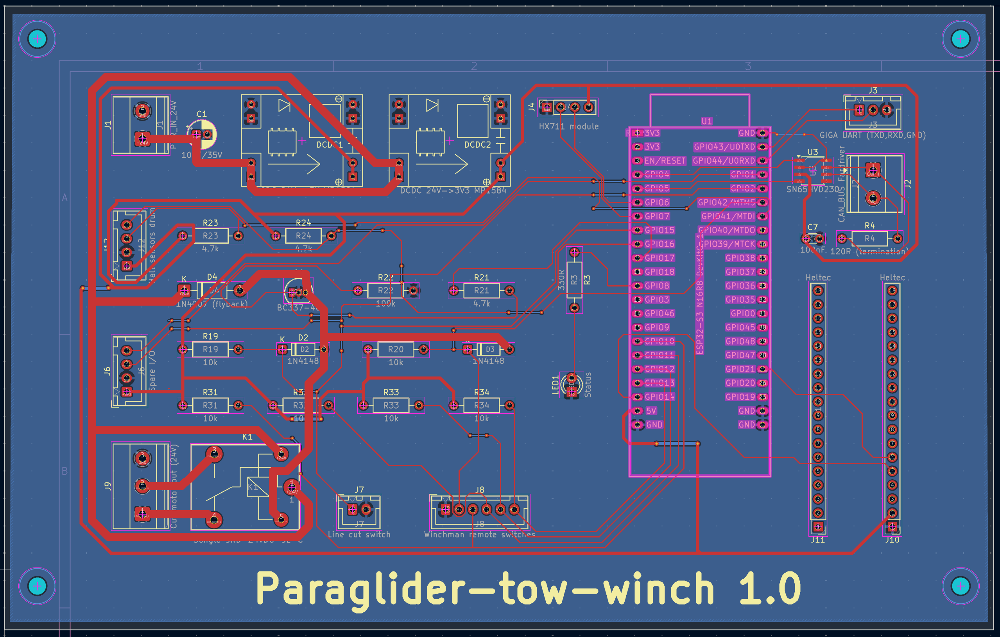
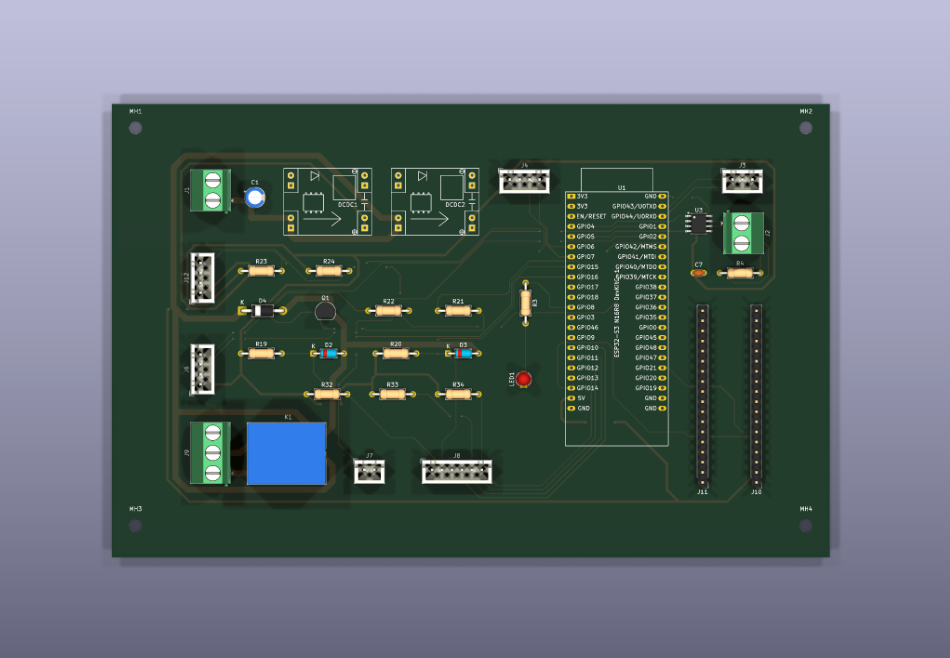

# Open Paraglider Tow Winch

# Electronics Architecture

Version 0.1

---

## Overview

The electronics are split into three nodes, kept deliberately separate so that display/communication work can never introduce jitter into the safety-critical force control loop (see [control_philosophy.md](control_philosophy.md)):

```
Load Cell ──▶ ESP32 (PID loop) ──CAN──▶ Fardriver Controller ──▶ QS165 Motor
                  │  ▲
              UART│  │UART
                  ▼  │
         Arduino GIGA R1 + Display        LoRa ◀────────────▶ LoRa
              (operator UI)          (winch-side module)   (pilot handheld)
```

This is a design decision, not yet built - no firmware or wiring exists for this architecture yet.

---

## Motor Controller: Fardriver ND961200-CAN

The CAN variant was chosen over the standard serial-only version for noise immunity next to a high-current controller and for clean telemetry output.

**RESOLVED 2026-08-03: throttle/torque command by CAN is real and documented.** The commonly available reverse-engineered manual only documents CAN as telemetry-out / BMS-style status-in (SOC, discharge current limit, gear, brake, charge-enable) - no message there for commanding throttle, torque or current. A fuller official-style parameter manual then surfaced a real **"driverless"/VCU protocol** (named control-ID variants "driverless 9" / "driverless 59", OEM VCU protocol options in section 9.18) confirming the capability exists, but without publishing the actual frame layout - that's gated behind picking a named protocol variant. Fardriver support (info@far-driver.com) provided the real protocol document on request: a **20ms-cycle VCU control frame** (extended ID `0x10F80807`-`0x10F8F807` / standard ID `0x101`-`0x1F1`) carrying gear, brake, control-mode select (throttle/torque/speed), and a signed 16-bit setpoint - with a **150ms CAN-loss timeout** that falls back to the analog line-throttle input. The controller also broadcasts a matching 20ms telemetry frame (`0x10F90708`-`0x10F908F8`) with realized torque/current/speed, feeding directly into the ESP32's tension-PID loop.

**Firmware plan updated accordingly:** command the motor directly via CAN (torque mode is the likely pick for tension control) rather than building an analog-throttle-spoof circuit - pending confirming the ordered ND961200-CAN unit actually implements this protocol on real hardware (not yet tested). Must also **enable CAN control in the Fardriver PC config app** - a config toggle (the doc's "control type=48"), not automatically active just because the hardware variant supports it.

**Analog throttle kept as a documented fallback only, not the primary build target** - the 150ms CAN-loss timeout relies on the controller's analog throttle input holding a valid, never-floating voltage at all times (see the gotcha below), so the physical wiring for it still needs to exist even though the ESP32 won't drive it in normal operation.

**Throttle voltage reference (for the analog fallback):**

- E-bike handlebar throttle: 0.8-0.9 V idle, 4.1-4.3 V full
- 12 V accelerator pedal: 0-0.2 V idle, 4.6-4.8 V full

**Gotcha - throttle plug protection:** unplugging or floating the throttle signal triggers a fault bailout on the controller. The emulated throttle circuit must always present a valid voltage and must never float, in every firmware state including startup and fault handling - this now matters specifically as the CAN-loss fallback path, not the everyday control path.

---

## Battery: 2x EEL 48V boxes, one 30-cell string under a single BMS

Two EEL 48V battery box enclosures house the cells (physical envelope already modelled in `battery_box.py` / `config.py`, `BATTERY_COUNT = 2`) - but electrically this is **one continuous 30-cell series string managed by a single BMS**, not two independently-managed 48V boxes stacked in series as originally planned.

**Why not two independent BMS units in series (the original plan):** each EEL box ships with its own Seplos Smart BMS 3.0. Its own spec PDF states plainly it **cannot be used in series** - each unit's analog sensing/balancing/comms is referenced to its own pack's negative terminal, so stacking two independently-referenced 48V boxes would float the top box's entire BMS 48-57V above true system ground, which consumer BMS analog front-ends generally aren't designed to tolerate (risk of damaged electronics or corrupted balancing/comms).

**Decision: replace both boxes' Seplos BMS units with a single BMS spanning all cells as one series string** - **ANT Smart BMS, 30S variant** (420A continuous / 1050A peak for 10s, 112V-rated, LiFePO4). Chosen over two other 30-32S-class candidates considered (QUCC QJ-2532U4CB, Heltec Energy 2-32S relay-based) mainly because of the user's own 3-year trouble-free history running an ANT BMS on an unrelated system, and because the Heltec relay-based unit's spec sheet never publishes a DC breaking/interrupting current rating for its main disconnect - the number that actually matters for a relay switching large DC currents without welding its own contacts shut. The 1050A/10s peak rating comfortably covers the CAN61 protocol's own torque-ramp rate limit (max 1/32 of full torque per 20ms tick - even a full 0-to-max ramp takes >=640ms).

**Cell count dropped 16 -> 15 per box (30 total, not 32):** the Fardriver ND961200's 115V overvoltage disconnect threshold left only ~1V margin at the original 32 cells x 3.65V max = 116.8V. Dropping to 30 cells total (15/box) gives 30 x 3.65V = 109.5V max - ~5.5V (4.8%) margin, covering BMS balance overshoot, charger overshoot, and regen-braking voltage spikes.

**Battery wiring quality matters more than usual here:** during regen/braking, current reverses, so IR drop in the wiring *adds to* (not subtracts from) the voltage the controller sees - thin/loose wiring directly erodes the overvoltage margin the cell-count change was meant to buy back. Plan for heavy-gauge wiring and clean, torqued lugs as a second, independent lever alongside the cell-count reduction.

**Open item:** the tows-per-charge estimate below still uses the original 32 kWh two-independent-16S-box figure - not yet recalculated against the 30-cell/single-string architecture (slightly fewer cells at a slightly higher string voltage; expected to land in the same ballpark, but not confirmed against the cells' real Ah rating).

### Tows per charge (simple estimate, capacity figure not yet updated for the 30-cell architecture above)

Energy used per tow = tow force x length of rope reeled in (work = force x distance), reduced by drivetrain losses (chain, bearings, gearbox friction) before it reaches the rope.

Assumptions (first-order, adjust once real tow profiles are measured):

- Average tow force: 70 kgf (between `TOW_FORCE_MIN` 40 kg and `TOW_FORCE_MAX` 100 kg)
- Rope paid out per tow: full `ROPE_LENGTH`, 1500 m (worst case - a shorter release height uses proportionally less energy)
- Mechanical loss: 30%

```
Mechanical work at the rope   = 70 kgf x 9.81 x 1500 m = 1.03 MJ = 0.286 kWh
Electrical energy from battery = 0.286 kWh / (1 - 0.30)          = 0.409 kWh per tow

Tows per full charge = 32 kWh / 0.409 kWh ≈ 78 tows
```

Simplified: constant tow force, full rope payout, no regen credited, no auxiliary/electronics draw. A shorter typical release height or effective regen on payout would push this number up; a higher average force would pull it down. Large enough either way that tows-per-charge becomes known through use, so live SOC monitoring in the control loop still isn't needed - SOC can be read off the BMS's own display/app.

---

## ESP32 Control Node

Runs the PID tension-control loop (load cell feedback -> throttle/torque command) and speaks CAN to the Fardriver controller.

**Why ESP32:** chosen over a Raspberry Pi because Linux scheduling jitter is a poor fit for a real-time actuation loop, and over a Teensy/STM32 because the winch's mechanical time constants (rope/motor, tens to hundreds of ms) don't need Teensy-level determinism. Teensy 4.x remains the upgrade path if the ESP32 ever feels tight.

**Variant: ESP32-S3, final form factor an N16R8 DevKitC-1 plug-in board** - superseded the earlier classic-ESP32 (WROOM-32) pick once mainboard PCB work started (see "Mainboard PCB" below for the full core-selection history, including a brief bare-WROOM-1-module stage before settling on the DevKitC-1). The S3's native USB (no external UART bridge needed for programming/debug) and extra GPIO/ADC headroom outweighed the classic ESP32's slightly larger e-bike/CAN-reverse-engineering example-code precedent, which was the original reason for that pick.

**CAN bus count:** originally assumed two buses were needed (Fardriver + battery BMS), which drove a comparison between dual-CAN dev boards (LilyGO T-2CAN) and single-CAN boards with extra I/O (Waveshare ESP32-S3-POE-ETH-8DI-8DO). **Resolved:** the battery CAN link was dropped - the pack is 32 kWh, large enough that pulls-per-charge become known through use, and SOC can simply be read off the battery box's own display. A single CAN bus (Fardriver only) is sufficient, so a plain ESP32 with native TWAI (only needs an external transceiver such as an SN65HVD230) is viable. The Waveshare board's isolated digital I/O (8 in / 8 out, optocoupled) remains attractive for winch safety I/O (e-stop, rope-end limit switch, contactor/relay control) and is still under consideration on that basis, independent of the CAN question.

**Analog throttle fallback (if CAN throttle command doesn't pan out):** a proper DAC output, e.g. MCP4725 over I2C, rather than the ESP32's built-in 8-bit DAC, for a cleaner and higher-resolution signal, calibrated to the controller's idle/full throttle voltage thresholds above.

---

## Pilot Handheld Remote

**Board:** [Heltec ESP32-S3 + SX1262 LoRa V4 touchscreen](https://www.amazon.com/Heltec-Development-Touch-2800mAh-Meshtastic/dp/B0G58QZYH9) - 3.5" capacitive touch, GPS, 2800 mAh battery, aluminium case.

**Why not stock Meshtastic:** Meshtastic's mesh-routing stack adds unpredictable latency, unsuitable for a safety-critical e-stop link. The plan is custom **point-to-point LoRa firmware** (e.g. via RadioLib on the same SX1262 chip) instead of the full Meshtastic stack - the LoRa radio layer and the Meshtastic mesh protocol are independent, so this board's hardware doesn't require running Meshtastic.

**Why touchscreen alone isn't enough:** a touchscreen is a poor fit for an e-stop a pilot needs to hit instantly with gloves on. The touchscreen is kept for **status display only** (tension, SOC, etc.); actual control input goes through **physical tactile switches added to the case**. This board was specifically chosen because its aluminium enclosure is strong enough to drill and mount extra switches into, unlike a plastic dev-board case.

**Frequency band: EU868**, not EU433. EU433 has a theoretically lower-frequency propagation edge but needs a physically longer antenna (~17 cm quarter-wave vs. ~8.6 cm for EU868) - not wanted on a handheld. EU868 also allows up to 500 mW EIRP on its special sub-band (vs. ~10 mW typical for EU433) and is the more mature, better-supported band for this hardware.

**Must match on both ends:** the winch-side LoRa module (to be added to whichever ESP32 board is chosen) must be ordered/configured for the same EU868 band, or the two ends will not talk to each other at all. Double-check the exact SKU when ordering - don't assume a generic "LoRa module" listing defaults to the right region.

**Barometric height, not GPS, for the tree-height trigger.** GPS vertical accuracy (typically ±10-20 m, worse on a cold fix right at launch) is too coarse for a threshold in the 10-30 m band (±4 m accuracy is the actual target and is sufficient). A cheap I2C MEMS barometric sensor (BMP388/BMP390/DPS310 class) easily matches that on raw resolution (the same sensor family used in dedicated variometers, e.g. the user's Brauniger, which resolves ~30 cm). **Auto-zeroed at the start of each tow** (same convention as a vario's ground-level reset), so the reading is height-above-launch, not absolute altitude - weather-driven barometric drift is a non-issue over the seconds it takes to climb through tree height.

**Flagged - don't underestimate the filtering.** Raw sensor resolution is not the hard part; the reason dedicated varios like Brauniger/Flytec are trusted is the filtering on top of the raw pressure reading: temperature compensation (MEMS dies drift with temperature), rejecting dynamic-pressure noise from motion/wind/airflow over the vent without adding response lag, and balancing fast reaction against noise rejection - this is genuine, non-trivial DSP work, not a moving average. Two more realistic paths than writing a filter from scratch:
- Reuse a proven open-source vario filter implementation rather than inventing one - user is searching for these.
- Check whether the Brauniger (or another owned instrument) already exposes a serial/Bluetooth telemetry output (many flight instruments do, e.g. NMEA-style vario sentences) - reading a unit already known to be trustworthy sidesteps reimplementing sensor fusion entirely.

**Sensor + library candidate, found 2026-08-01:** BMP388 via the Adafruit BMP3XX library ([tutorial](https://randomnerdtutorials.com/arduino-bmp388/)), I2C (SDA/SCL) or SPI. Covers part of the filtering concern above in hardware: the sensor itself does oversampling (2x-32x) and has a configurable IIR filter (coefficient up to 127), plus its own temperature-compensation calibration - so temp drift and basic noise smoothing don't need to be written from scratch, only tuned (oversampling/IIR settings, output data rate up to 200 Hz). Still doesn't cover wind/dynamic-pressure noise rejection specifically - that needs bench-testing outdoors before trusting it as the auto-trigger. Sea-level-pressure calibration (`SEALEVELPRESSURE_HPA` in the tutorial) is irrelevant here since the design auto-zeros per tow - only the pressure delta from the zero point matters, not absolute altitude.

**Second candidate, same day: BMP280.** [Datasheet](https://cdn-shop.adafruit.com/datasheets/BST-BMP280-DS001-11.pdf) specifies **±0.12 hPa relative accuracy, equivalent to ±1 m altitude** (950-1050 hPa @ 25°C) - comfortably inside the ±4 m target - plus 1.3 Pa RMS noise and only 12.6 cm/K temperature-offset drift. Older/cheaper/lower-power predecessor to the BMP388, same Bosch APSM MEMS lineage, same IIR-filter/oversampling hardware features. Has a working reference implementation: [arduino_variometer](https://github.com/01ive/arduino_variometer) (MIT license, ~€26 BOM: Arduino Nano + BMP280 + MPU6050 accel + piezo buzzer) - a real built vario using this exact chip, worth reading for wiring/part choices even though its filtering approach isn't documented in the repo itself (would need to read the source directly). User is continuing to search before committing to BMP280 vs. BMP388/BMP390/DPS310.

GPS is kept on the handheld for **track logging only** (nice-to-have, not part of the safety trigger).

---

## Operator UI: Arduino GIGA R1 WiFi + GIGA Display Shield

Display and operator input only - deliberately kept **out of the actuation loop** so display/WiFi work never introduces jitter into the control timing.

The GIGA R1's dual-core STM32H747 lets the M4 core handle display rendering while the M7 core runs the app logic. The GIGA and the ESP32 talk over a simple UART link: the ESP32 streams tension/RPM/current/fault state to the GIGA for display, and the GIGA sends operator command input back.

**Gotcha:** the GIGA Display Shield looks Mega-shield-footprint compatible but needs a middle high-density connector that only exists on the GIGA R1, and the GIGA runs 3.3 V logic vs. the Mega's 5 V - it cannot be stacked on a plain Mega board.

---

## Unified Operator Command Protocol

The GIGA (winch operator) and the pilot's LoRa handheld both act as command sources for the ESP32, carrying the **same command/telemetry protocol over two different transports** - UART for the GIGA, LoRa for the handheld. The ESP32 parses one protocol regardless of which link a frame arrived on, rather than maintaining two separate command sets.

- **Winch operator (GIGA):** full command surface - tension setpoint/profile selection, state machine control, fault reset, full telemetry display (tension, RPM, current, fault state).
- **Pilot handheld:** deliberately minimal input, matched to what a pilot can operate instantly with gloves on - a **deadman button** and an **"above tree height" button** (manually commits the ramp to the pilot-weight tow force profile), both as physical tactile switches, not touchscreen controls. The touchscreen stays status-display-only (tension, SOC, etc.); barometric height (see above) is intended to eventually derive the tree-height transition automatically rather than relying solely on the manual button.

---

## Mainboard PCB (KiCad)

Schematic + PCB for the ESP32-S3 control node, in `kicad/winch_mainboard/` (KiCad 10). **Design is complete and ready to order**: ERC-clean (0 violations) and DRC-clean (0 real violations, 1 cosmetic silkscreen-text overlap on U1), fully placed and routed, board outline 180.5x114mm.


*Top copper layer, fully routed - red traces on F.Cu, GND pour on the back layer.*


*3D render of the finished board.*

**Core: ESP32-S3 N16R8 DevKitC-1 (plug-in board, 2026-08-15 - changed from a bare WROOM-1 module).** Briefly used a bare WROOM-1 module (symbol/footprint from [JustasBart/ESP32-KiCad-libraries](https://github.com/JustasBart/ESP32-KiCad-libraries), verified pin-for-pin identical to the official Espressif PCM library it replaced), but the user then chose to switch to a plug-in DevKitC-1 board instead - reasoned to be much easier to route (a 2-row 2.54mm header is a far more forgiving target for hand/auto-routing than a dense 3-edge castellated SMD module). Symbol/footprint also sourced from JustasBart's repo (same library, different part - `ESP32-S3-DevKitC`, 44-pin 2-row THT header, confirmed against a real product listing for this exact board). The devkit is self-sufficient (its own onboard USB-C, RST/BOOT buttons, and 3.3V regulator), so several support components this board used to provide became redundant and were **removed**: the USB-C connector (J5) and its CC resistors/VBUS diode (R5/R6/D1), the EN pull-up/reset button (R1/SW1/C6), the GPIO0/BOOT pull-up/button (R2/SW2), and the module decoupling caps (C4/C5). Only **+5V** (feeds the devkit's onboard regulator) and **GND** are wired for power - the devkit's own 3V3 output pins are deliberately left unconnected (never tie two independent regulator outputs together), as are EN/BOOT/USB D+/D- (the devkit drives these internally). Net map is by **GPIO identity**, not pin position - the devkit's header pin numbers don't correspond to the old module's pin numbers at all, only the GPIO each carries does.

**Power:** a Victron 96V-to-24V DC/DC converter (external, off-board) feeds the mainboard at +24V. Two independent plug-in buck-module headers generate +5V and +3V3 directly from +24V (no linear regulator - a 24V-to-3.3V LDO would dissipate too much heat for continuous tow duty). Both use the real **MP1584 buck module footprint** (community footprint from [kubabuda/misc_footprints](https://github.com/kubabuda/misc_footprints), bundled locally in `kicad/libraries/misc_footprints/` - the repo's footprint predates KiCad's modern format, converted in place with `kicad-cli fp upgrade`). **Pad-to-function mapping is a reasonable best guess, not confirmed:** the footprint has no per-pin silkscreen labels, just 4 pads (2 on the input side, 2 on the output side) - pin1/2 = input, pin3/4 = output is the standard physical layout for this module family, but which exact pad is +/- within each side isn't confirmed from a labelled pinout. **Verify against the real module's own silkscreen (VIN+/VIN-/VOUT+/VOUT-) before soldering.** +5V feeds the ESP32-S3 devkit's onboard regulator (see Core, above); the board can also be bench-programmed through the devkit's own USB-C port without the 24V supply connected, same as before, just via the devkit's own port now rather than a dedicated connector on this board.

**Load cell amp (HX711):** header only, not the HX711 chip itself - a standard off-the-shelf dual-channel HX711 breakout module mounts **flat, directly on the mainboard** (not via a cable): J4 is a `PinSocket_1x04_P2.54mm_Vertical` socket, and the module's own 4-pin header (JP2) plugs straight down into it, shield-style. Its 6-pin load-cell terminal row (E+/E-/A+/A-/B-/B+, only one channel used) faces away from the mainboard. **Pin order is reversed from the module's own printed silkscreen** (`GND, DT, SCK, +3V3` on J4 pins 1-4, not `VCC, SCK, DT, GND`) - this is deliberate, not a mistake: with the module mounted header-pins-up/load-cell-side-down (the intended orientation), the header reads in the opposite direction from the module's own top-down silkscreen labels. Confirmed by physical test-fit, not just the (mirrored) product photo. **Powered from 3.3V, not 5V** - deliberate: the HX711's DT output would swing to whatever voltage powers it, and a 5V-powered HX711 driving DT into the ESP32-S3's 3.3V-only (not 5V-tolerant) GPIO would risk damaging it. Running the HX711 at 3.3V instead is common practice and avoids needing a level shifter, at the cost of slightly reduced load-cell excitation range (not expected to matter here).

**CAN:** SN65HVD230 transceiver (3.3V, matches the ESP32-S3 GPIOs directly, no level shifting needed) plus a 120R termination resistor at the connector. If the Fardriver end of the bus already terminates itself, this resistor may need removing - not yet confirmed.

**USB-C:** native USB (ESP32-S3's D+/D- direct to the connector, no external UART bridge) for programming and a debug/console link, independent of the CAN/UART links.

**GIGA UART (winchman display):** dedicated 3-pin locking connector (ESP32_TXD, ESP32_RXD, GND) on UART0, separate from the native-USB pins - the two links don't share hardware.

**Line-cut system - the safety-critical addition.** Two physical switches (one mounted on the winch, one on the winchman remote) can each fire the line-cutter relay **directly in hardware**, independent of firmware:
- Each switch is a simple GPIO-monitored input (10k pull-up to 3V3, active-low), so firmware can read/log which switch (if either) was pressed.
- Each switch's sense line *also* feeds a diode (1N4148, cathode toward the switch) into the shared `RELAY_COIL_LOW` node - closing either switch pulls that node toward GND through its own diode, energising the relay coil **regardless of whether the ESP32 firmware is running.**
- Firmware has its own independent path to the same node: a GPIO through a base resistor drives an NPN transistor (BC337-40) that can also pull `RELAY_COIL_LOW` low - this is the "should be possible to initiate by software too" path. A base pulldown resistor keeps the transistor off by default (e.g. during boot, before firmware sets the pin).
- The relay (SPDT, 24V coil, e.g. Songle SRD-24VDC-SL-C) switches +24V through to a screw-terminal output for the cutting motor. A flyback diode (1N4007) sits directly across the coil.
- **Relay part chosen and footprint fully wired (2026-08-15): Songle SRD-24VDC-SL-C.** Its datasheet (via the KiCad footprint's own citation - the physically-identical Sanyou SRD-series part family) confirms COM is the isolated pad and the coil pins are the close pair, but does not print which of the remaining two pads is NO vs NC (common gap in budget relay datasheets, and this session couldn't resolve it any other way either - see memory for the full trail). **Rather than guess on a circuit that switches the cutting motor, both relay contacts are wired out separately** (`CUT_MOTOR_A`/`CUT_MOTOR_B`) to a 3-position terminal (J9) alongside GND, instead of committing one contact to a fixed `CUT_MOTOR_OUT` net - wire the actual motor between GND and whichever terminal tests as NO (continuity to COM while the relay is unpowered = NC, the other is NO) once the part is in hand. The unused terminal is spare, or usable later as an NC "not cutting" sense input. J9's silkscreen spells out the pinout directly (`1/2=K1 contacts A/B (verify NO), 3=GND`) so this doesn't need to be re-derived from the schematic when wiring up the real board.
- **Inherent limitation, not fixable in the circuit:** if the +24V supply itself is lost, no cut path works (mechanical/spring-loaded fallback would be the only way around this, and isn't part of the current design).

**Winchman remote - 5 switches on one 6-pin locking connector** (shared GND + one sense line each): line cut, emergency stop, tension +5kg, tension -5kg, tension reset-to-programmed. Only the line-cut switch gets the hardware relay bypass described above - the other four (e-stop, both tension nudges, tension reset) are plain firmware-read inputs (10k pull-up each), since they're software state-machine actions rather than a physical safety action to bypass into - e-stop "brings the state to idle," which is inherently a firmware concept, not a hardware one.

**Pre-order check caught a real omission (2026-08-16):** the e-stop pull-up resistor (R31, 10k, `+3V3` to `ESTOP_SENSE`) existed in the schematic but had no footprint anywhere on the PCB - its three siblings (the tension +/-/reset pull-ups) were all present, only this one had been dropped somewhere along the way. Fixed: added and routed. Worth remembering as a general check before ordering any board - a schematic/PCB reference cross-check (every schematic component should have a matching PCB footprint, and vice versa) catches this class of silent omission that ERC/DRC alone won't, since a component that was never placed doesn't show up as an "unconnected pad."

**LoRa (winch-side, talks to the pilot's Heltec SX1262 handheld) - architecture changed from the original plan.** User chose a **Heltec WiFi LoRa 32 V4** board for this. That board has its *own* ESP32-S3 driving its onboard SX1262 (plus an OLED, GNSS header, USB-C, and battery/solar inputs) - it's a full standalone dev board, not a bare radio breakout to drive directly over SPI as originally planned. Its exposed "LoRa_NSS/SCK/MOSI/MISO/RST/BUSY/DIO1" pins (from the board's own pin map) are already committed internally to its onboard radio - not available to reach in from outside.

Treated the same way the GIGA display already is: a **UART-attached peripheral** running its own firmware, not something this mainboard drives directly. **Connector footprint resolved (2026-08-15):** user supplied the Heltec board's own reference KiCad files and its official pin-map, confirming the real physical connector is **two 1x18, 2.54mm-pitch THT headers** (Heltec's own "J2" and "J3" designators) rather than a single small cable connector. Only J2 is wired - pins 1 (GND), 2 (5V), 5 (U0RXD, cross-connects to our `LORA_TXD`), 6 (U0TXD, cross-connects to our `LORA_RXD`) - the other 14 pins on J2 and all 18 on J3 (a second full header exposing more of the Heltec's GPIOs) are left completely unconnected/reserved for future use, same pattern as the spare I/O header. "5V"/"Ve" (J2 pins 2-4) is the documented external-supply input pin (confirmed from the real pin-map image, not just assumed from typical dev-board convention as before) - the Heltec's "3V3" pins are its regulator *output*, not an input, so still not used to power it.

This swap also freed 5 GPIOs (was 7 pins for direct SPI control, now 2 for UART) - a big improvement to the GPIO budget below.

**Drum-direction hall sensors:** one locking connector for both sensors (they sit close together near the drum flange and share a cable run) - shared +5V/GND, two separate sense lines. Powered at 5V for wider sensor-part compatibility, but each sense line is pulled up to 3V3 (not 5V) rather than whatever the sensor's own supply is - assumes an open-collector sensor output (common for digital Hall switches), so the GPIO never sees more than 3.3V regardless of the sensor's own supply voltage. Same reasoning pattern as the HX711 3V3 choice above.

**State-machine indicator LEDs and I2C multiplexer - REMOVED (2026-08-15).** The original design had a vertical row of 6 state LEDs (idle, calibrating, start procedure, low-power tow, normal tow, releasing) driven through a PCF8574 I2C GPIO expander. Removed for simplification, along with its resistors (R25-R30, and the SDA/SCL pull-ups R35/R36) - the board's only remaining LED is the single direct-GPIO status LED (LED1). Frees GPIO9 and GPIO18 (was SCL/SDA) back to the spare pool.

**Real bug caught before it mattered (historical note):** the very first version of every LED on this board (the status LED and, briefly, the now-removed state-LED row) had **anode and cathode swapped** - the LED's cathode went to the series resistor/drive signal and its anode went straight to GND, which means it would never light under any drive condition (current can't flow anode-to-cathode with the anode pinned at 0V - reversed from the intended "GPIO sources current" or "expander sinks current" pattern). KiCad's ERC does not catch this - electrically the circuit is completely valid, just backwards - so it only surfaced from actually reasoning through current direction and confirming it against a rendered close-up of the symbol. Worth remembering for any future diode/LED addition: getting a clean ERC does not mean the polarity is functionally correct.

**Connector style:** locking connectors (JST-XH) for every off-board cable run - line-cut/winchman-remote switches, hall sensors, GIGA UART, HX711 - so nothing vibrates loose on a moving winch. Power/CAN/motor-output connections use Phoenix Contact MKDS 1,5 (5.08mm pitch) terminal blocks (user-specified part family; the 2-position member of the series, since all of this board's terminal blocks are 2-pin) - already inherently captive, and better suited to higher current than JST-XH. The buck-converter modules use their own real footprint (not a connector) since they're soldered directly to the board. The Heltec LoRa board is the one exception - it uses its own real 1x18+1x18 2.54mm pin-header footprint (J10/J11, see LoRa section above) rather than a JST cable connector, since that's the board's actual physical connector.

**Spare I/O header:** 9 unused GPIOs (1, 2, 9, 18, 38, 39, 40, 47, 48) plus 3V3/GND - GPIO9/GPIO18 joined the spare pool when the I2C state-LED expander was removed. J6 (the physical spare-I/O connector) currently only breaks out 2 of these; the rest are free on U1 but not yet wired to a header pin - worth revisiting when placement is redone.

**Pin map (ESP32-S3-DevKitC-1, N16R8 - GPIO identity carried over unchanged from the earlier bare-WROOM-1 design):**

| Function | Pin (GPIO) |
|---|---|
| CAN TX / RX | GPIO4 / GPIO5 |
| HX711 SCK / DT | GPIO6 / GPIO7 |
| Status LED | GPIO8 |
| Line-cut switch sense (winch / winchman remote) | GPIO15 / GPIO16 |
| Line-cut relay drive (software path) | GPIO17 |
| Winchman remote: e-stop / tension+5kg / tension-5kg / tension reset | GPIO10 / GPIO11 / GPIO12 / GPIO13 |
| LoRa UART (Heltec board) TXD / RXD | GPIO14 / GPIO21 |
| Drum hall sensors A / B | GPIO41 / GPIO42 |
| GIGA UART TX / RX | GPIO43 (U0TXD) / GPIO44 (U0RXD) |
| USB D- / D+ | GPIO19 / GPIO20 (native USB, fixed pins) |
| Spare I/O | GPIO1, GPIO2, GPIO9, GPIO18, GPIO38, GPIO39, GPIO40, GPIO47, GPIO48 |

GPIO3, GPIO45, GPIO46 (strapping pins) and GPIO35-37 (used internally on the DevKitC-1's octal PSRAM, confirmed - this is the N16R8 variant, 16MB flash + 8MB octal PSRAM) are deliberately left unused, to avoid boot-strapping or PSRAM conflicts.

**Open items:**
- Buck module (MP1584) pad-to-function mapping is a geometry-based best guess, not confirmed from a labelled pinout - verify before soldering (see above).
- CAN termination resistor may need removing depending on the Fardriver end's own termination.
- Whether the cutting motor's +24V is the same rail as the board logic's +24V input, or a separate supply, is assumed (same rail) but not confirmed.
- ~~Heltec board's "5V" header pin accepting external input~~ **RESOLVED** - confirmed from the real Heltec V4 pin-map image ("Ve", J2 pins 3/4, documented external-supply input).
- ~~Relay footprint not assigned~~ **RESOLVED** - Songle SRD-24VDC-SL-C, both contacts broken out to J9 (see above).
- ~~No routing yet~~ **RESOLVED** - board is fully placed and routed, see "Mainboard PCB Placement" below. Ready to order.

## Mainboard PCB Placement

**Final state: placement and routing complete, board ready to order.** After an early auto-generated layout and a full reset forced by the DevKitC-1 core swap (wide-spaced 380x335mm starting layout, deliberately loose so parts were easy to grab and rearrange by hand), the user placed every component and routed the whole board by hand in the KiCad GUI, including a back-layer GND copper pour (`back_gnd` zone). **Final board outline: 180.5x114mm** - shrunk down once the layout was arranged compactly, nowhere near the original wide-spaced 380x335mm placeholder size. 2-layer board (F.Cu/B.Cu), track widths 0.2-1.5mm and drill sizes 0.3-3.2mm, both comfortably within any standard fab's capabilities.

**K1 (relay) is fully wired, not a placeholder** - see the relay section above for why both contacts route out separately instead of picking one. The schematic symbol's IEC-style pin names (A1/A2/11/12/14) don't match the real footprint's plain numbered pads (1-5), so this needed an explicit pin-number translation for this one part - every other component's schematic pin numbers and footprint pad numbers already happen to match directly.

**J4 (HX711 header) went through a real footprint change late in the process** - originally a JST-XH cable connector, changed to a `PinSocket_1x04_P2.54mm_Vertical` socket for flat, direct-plug mounting (see "Mainboard PCB" above), with the pinout reversed to match the module's real mounted orientation. Swapping a connector's footprint (different pad pitch/geometry) invalidates any already-routed copper near it even when the net list itself doesn't change - this happened here (2 existing traces went dangling, needed re-routing) and is worth remembering for any future footprint swap on a partially-routed board.

**Pre-order sanity check (2026-08-16) caught one real omission:** R31, the e-stop pull-up resistor, existed in the schematic but had no footprint on the PCB at all (see the winchman-remote section above) - found via a schematic-vs-PCB reference cross-check, fixed by placing it against an already-existing (but previously dangling) `+3V3` stub trace and routing its other pin to the `ESTOP_SENSE` net. This is the kind of omission that a clean ERC/DRC won't catch by itself, since a component that was never placed doesn't register as an "unconnected pad" - worth re-running this cross-check before ordering any future revision of this board too.

**Final verification: ERC 0 violations, DRC 0 real violations** (1 cosmetic silkscreen-text overlap between U1's Value field and one of its own GPIO pin labels - visual only, no manufacturing or electrical impact). All 4 mounting holes present, no duplicate reference designators, no orphaned/missing footprints, no DNP components.

## Open Items

- Fardriver driverless/VCU CAN frame spec: **RESOLVED** - full CAN61 protocol document obtained from Fardriver support (see "Motor Controller" above). Still needs confirming against the real ND961200-CAN unit on the bench once hardware is in hand; analog throttle kept wired as the documented CAN-loss fallback either way.
- Final ESP32 carrier board choice: **RESOLVED** - plain ESP32-S3 N16R8 DevKitC-1 + external SN65HVD230 CAN transceiver, built into the mainboard PCB (see "Mainboard PCB" above). The earlier LilyGO T-2CAN / Waveshare ESP32-S3-POE-ETH-8DI-8DO candidates (from when 2 CAN buses were still assumed necessary) were not needed once the battery-CAN requirement was dropped.
- Winch-side LoRa: **RESOLVED** - Heltec WiFi LoRa 32 V4 (EU868, matching the pilot handheld's own Heltec board), wired to the mainboard as a UART peripheral via its real two-header (1x18+1x18) footprint (see "Mainboard PCB" above). A different, similarly-named Heltec module (HT-CT62) was briefly considered and rejected - different chip, ESP32-C3 not S3.
- Battery BMS architecture: **RESOLVED** - single ANT 30S BMS spanning both EEL boxes' cells (30 total, not 32) instead of two independent per-box BMS units in series (see "Battery" above). Tows-per-charge estimate still needs re-checking against the new cell count.
- Define the actual unified command/telemetry frame format (fields, encoding) shared by the GIGA UART link and the pilot LoRa link.
- Choose and wire up a barometric sensor for the pilot handheld; decide how much the tree-height transition trusts the sensor vs. the manual button.
- **Mainboard PCB design is complete and ready to order** (see "Mainboard PCB Placement" above). No firmware exists yet - that's the next phase once the board is back and verified working. All other wiring diagrams (GIGA UI node, LoRa handheld/winch-side module) are still outstanding.
