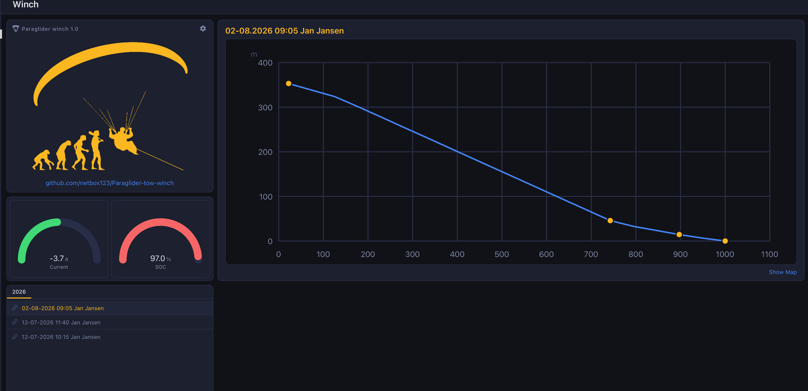

# Open Paraglider Tow Winch

# Software Architecture

Version 0.1 (first draft - ESP32 mainboard comms layer only, no PID/CAN control logic yet)

---

## Overview

Three firmware nodes, matching the hardware split in [electronics.md](electronics.md):

```
Load Cell ──▶ ESP32 (PID loop) ──CAN──▶ Fardriver Controller ──▶ QS165 Motor
                  │  ▲
              UART│  │UART
                  ▼  │
         Arduino GIGA R1 + Display        LoRa ◀────────────▶ LoRa
              (operator UI)          (winch-side Heltec)   (pilot Heltec)
```

- **ESP32 mainboard** (`firmware/esp32_mainboard/`) - the only node covered by this document's protocol definitions and the only one with firmware started so far. Runs the state machine and (eventually) the PID tension loop and CAN61 link to the Fardriver controller.
- **GIGA R1 + Display** - winch operator UI. Talks to the ESP32 over the `GIGA UART` link (hardware UART0, see "Transports" below). Full command surface, full telemetry. Its own firmware is not started yet.
- **Pilot's Heltec handheld** - talks to the ESP32 *indirectly*, via the winch-side Heltec LoRa module (itself just a UART-attached peripheral of the ESP32, see [electronics.md](electronics.md)'s LoRa section). Minimal command surface (deadman + tree-height button), reduced telemetry (status display only). Neither Heltec's firmware is started yet.

**Both links carry the same JSON protocol** (same message types, same field names) - this is a deliberate design decision carried over from [electronics.md](electronics.md#unified-operator-command-protocol): the ESP32 parses one protocol regardless of which link a message arrived on, rather than maintaining two separate command sets. A message's `src` field (see below) tells the ESP32 which device sent it, which is what actually gates which command fields are honored - not which physical UART it arrived on.

---

## Transports

| Link | ESP32 pins | Arduino object | Notes |
|---|---|---|---|
| GIGA UART | GPIO43 (U0TXD) / GPIO44 (U0RXD) | `Serial0` | Hardware UART0. **Gotcha:** on the ESP32-S3 Arduino core, `Serial` defaults to the native USB-CDC port (GPIO19/20, the DevKitC-1's own USB-C), not this UART - use `Serial0` explicitly for this link, and reserve plain `Serial` for USB debug output only. Don't let the two get mixed up. |
| Heltec (winch-side) UART | GPIO14 (TXD) / GPIO21 (RXD) | `Serial1` | Bridges to the Heltec's own U0TXD/U0RXD (see [electronics.md](electronics.md)'s LoRa section) - the Heltec re-transmits whatever it receives here over LoRa to the pilot's matching Heltec, and forwards whatever it receives over LoRa back over this same UART. The ESP32 firmware doesn't need to know anything about LoRa itself, only that this UART is slower and lossier than the GIGA link. |

**Framing:** one **compact (no whitespace) JSON object per line**, terminated with `\n`. Baud rate 115200 on both links (the Heltec link is bandwidth-limited by the LoRa hop behind it, not by this UART - 115200 just needs to comfortably outrun the LoRa air rate, not match it).

**Why JSON, not a packed binary frame:** this is a human-interaction link (button presses, a display refreshing a few times a second), not the CAN61 link's 20ms real-time control loop - there's no tight timing budget to justify binary framing's added complexity. JSON is trivially debuggable from a serial monitor, which matters a lot for a first version. Revisit only if LoRa airtime/duty-cycle limits become a real constraint once tested on real hardware.

---

## Message Types

Every message has a `type` field that's either `"cmd"` (host -> ESP32) or `"telemetry"` (ESP32 -> host), plus a monotonically increasing `seq` (per-sender counter, wraps at 65535) so a receiver can notice dropped or out-of-order messages.

### `cmd` - host to ESP32

```json
{"type":"cmd","seq":42,"src":"giga","deadman":true,"tree_height":false,"state_cmd":"start_tow","tension_setpoint_kg":70,"fault_reset":false,"operating_mode":"winchman","pilot_name":"Jane Doe","pilot_weight_kg":85,"use_saved_calibration":false,"cal_raw_zero":123456,"cal_raw_100kg":234567,"under_tree_height_reduction_pct":40,"start_reduction_pct":20,"treeheight_to_full_tow_ramp_s":3,"start_to_treeheight_ramp_s":2,"release_before_taking_in_s":5,"pid_kp":1.2,"pid_ki":0.05,"pid_kd":0.01}
```

```json
{"type":"cmd","seq":103,"src":"handheld","deadman":true,"tree_height":false,"lat":47.123456,"lon":8.123456,"baro_alt_m":42.3}
```

| Field | Type | Sent by | Meaning |
|---|---|---|---|
| `type` | `"cmd"` | both | message discriminator |
| `seq` | uint16 | both | per-sender sequence counter |
| `src` | `"giga"` \| `"handheld"` | both | **which device sent this** - the ESP32 uses this to decide which of the fields below it's allowed to act on (see "Field authority" below), not which UART it arrived on |
| `deadman` | bool | handheld | pilot is actively holding the deadman control. Safety-critical - see "Deadman timeout" below |
| `tree_height` | bool | handheld | pilot has manually signalled "above tree height" - one-shot trigger, commits the ramp to the selected tow profile (see [control_philosophy.md](control_philosophy.md#launch-philosophy)) |
| `lat` / `lon` | number, optional | handheld | pilot's GPS position, sent every 2-5s - **log-only**, relayed straight into `telemetry` for the GIGA to write to its SD card (see "GPS + Logging" below and [electronics.md](electronics.md)'s note that GPS is never part of the safety trigger). Both must be present together or neither is applied |
| `baro_alt_m` | number, optional | handheld | pilot's barometric height above launch, sent alongside `lat`/`lon` - same log-only relay, **not** used for the tree-height trigger itself (that stays the manual `tree_height` button plus, eventually, the handheld's own local auto-trigger logic - see [electronics.md](electronics.md)'s barometric-height reasoning) |
| `state_cmd` | string, optional | giga | requested state-machine transition: `"calibrate"` (`IDLE`->`CALIBRATING`), `"calibration_done"` (`CALIBRATING`->`READY`, operator confirms the 100kg reference pull is done - see [control_philosophy.md](control_philosophy.md#calibrating)), `"start_tow"`, `"release"`, `"reset_fault"` (clears a latched fault **or** `EMERGENCY_STOPPED`, both return to `IDLE`), `"idle"`, `"emergency_stop"` (operator-triggered e-stop from GIGA - in addition to, not instead of, the mainboard's own local hardware e-stop switch, which forces this transition regardless of what any link is saying). Absent/omitted = no transition requested this message. **`"release"` can also be requested locally** by a physical switch on the winchman remote (see [electronics.md](electronics.md)), independent of this link entirely |
| `tension_setpoint_kg` | number, optional | giga | desired tow force, `TOW_FORCE_MIN`-`TOW_FORCE_MAX` kg (see `config.py`). A **numeric override**, not a named profile - profile-name-to-kg resolution, if wanted, happens in the GIGA's own UI, not on the wire (kept simple for this first version) |
| `fault_reset` | bool, optional | giga | acknowledge/clear a latched fault |
| `operating_mode` | `"solo"` \| `"winchman"`, optional | giga | set once at boot (see "Boot Configuration" below) - whether a winchman is operating the GIGA or the pilot is flying solo |
| `pilot_name` | string, optional | giga | set at boot, and again after every tow ends in `"winchman"` mode (see "Boot Configuration" below) - the current pilot's name, for tow-log administration (e.g. towing students with a winchman). Entered live on the winchman controller (GIGA touchscreen) at the winch, per tow - not something to prepare ahead of time elsewhere |
| `pilot_weight_kg` | number, optional | giga | set at boot, and again after every tow ends in `"winchman"` mode (see "Boot Configuration" below) - the current pilot's weight. Same live-at-the-winch entry as `pilot_name` |
| `use_saved_calibration` | bool, optional | giga | GIGA boot-UI switch, **default off** - when true (together with `cal_raw_zero`/`cal_raw_100kg`), skips the mandatory live `CALIBRATING` cycle and trusts the saved values instead. See "Boot Configuration" below |
| `cal_raw_zero` / `cal_raw_100kg` | integer, optional | giga | the saved two-point calibration reference (raw load-cell counts at 0kg and 100kg) from the GIGA's config file, only applied when `use_saved_calibration:true` |
| `under_tree_height_reduction_pct` / `start_reduction_pct` | number, optional | giga | tow-config tunables from the GIGA's SD-card config file - force reduction percentages for the under-tree-height and start phases. Not yet acted on by the control loop (see "Current Firmware Status") |
| `treeheight_to_full_tow_ramp_s` / `start_to_treeheight_ramp_s` | number, optional | giga | tow-config tunables - ramp durations between phases. Not yet acted on |
| `release_before_taking_in_s` | number, optional | giga | tow-config tunable - delay after release before the drum starts taking in rope. Not yet acted on |
| `pid_kp` / `pid_ki` / `pid_kd` | number, optional | giga | tow-config tunables - tension PID gains. Not yet acted on (no PID loop implemented yet) |

**Field authority (enforced on the ESP32, not just documented) - symmetric, each `src` is restricted to its own fields:**
- `src:"handheld"` can only affect `deadman`, `tree_height`, `lat`, `lon` and `baro_alt_m` - every GIGA-only field below is silently ignored if present with that `src`, even if the handheld's own firmware never sends them.
- `src:"giga"` can only affect `state_cmd`, `tension_setpoint_kg`, `fault_reset`, `operating_mode`, `pilot_name`, `pilot_weight_kg`, `use_saved_calibration`, `cal_raw_zero`, `cal_raw_100kg`, and the tow-config tunables above - `deadman`/`tree_height`/`lat`/`lon`/`baro_alt_m` from GIGA are likewise ignored, since those fields are meant to be the pilot's own live signal; letting the operator's UI set them too would defeat the point of the deadman check.

This is the wire-level version of the hardware design's own principle (see [electronics.md](electronics.md)'s winchman-remote section) that the pilot's remote gets a deliberately minimal, hard-to-misuse command surface - the ESP32 must not trust the far end's own firmware to self-restrict, since a link (LoRa especially) can be spoofed, glitched, or simply running old/buggy firmware.

### `telemetry` - ESP32 to host

```json
{"type":"telemetry","seq":1337,"state":"NORMAL_TOW","tension_kg":68.4,"tension_setpoint_kg":70,"rope_out_m":210.5,"rpm":842,"motor_current_a":38.2,"fault":false,"fault_code":0,"line_cut":false,"cal_valid":true,"boot_configured":true,"operating_mode":"winchman","pilot_name":"Jane Doe","pilot_weight_kg":85,"tow_config_loaded":true,"lat":47.123456,"lon":8.123456,"baro_alt_m":42.3}
```

| Field | Type | Meaning |
|---|---|---|
| `type` | `"telemetry"` | message discriminator |
| `seq` | uint16 | per-sender sequence counter |
| `state` | string | current state machine state - one of `IDLE`, `CALIBRATING`, `READY`, `LAUNCH`, `UNDER_TREE_HEIGHT`, `NORMAL_TOW`, `PAY_OUT`, `RELEASE`, `RECOVERY`, `EMERGENCY_STOPPED` (see [control_philosophy.md](control_philosophy.md#state-machine)) |
| `tension_kg` | number | measured tow force (load cell) |
| `tension_setpoint_kg` | number | current PID setpoint (may differ from what GIGA last requested, e.g. mid-ramp) |
| `rope_out_m` | number | estimated rope paid out (derived from hall sensors + drum diameter estimate) |
| `rpm` | number | drum RPM (from hall sensors) |
| `motor_current_a` | number | realized motor current, once the CAN61 telemetry frame is wired up - `0` / stale until then |
| `fault` | bool | true if a fault is latched |
| `fault_code` | integer | 0 = no fault; specific codes to be enumerated once fault handling is implemented |
| `line_cut` | bool | true if either line-cut switch has fired (informational - the relay itself fires in hardware regardless of firmware, see [electronics.md](electronics.md)'s line-cut section) |
| `cal_valid` | bool | true once a `CALIBRATING` cycle has completed successfully this session, **or** once a saved calibration has been loaded via `use_saved_calibration` (see [control_philosophy.md](control_philosophy.md#calibrating) and "Boot Configuration" below) - lets a display warn the operator if a tow is attempted before calibration is valid |
| `boot_configured` | bool | true once `operating_mode`, `pilot_name` and `pilot_weight_kg` are all set (see "Boot Configuration" below) - false blocks `calibrate`, so this tells the GIGA UI whether it still needs to prompt for them. In `"winchman"` mode this can go false again mid-session, after a release/fault clears `pilot_name`/`pilot_weight_kg` for the next pilot |
| `operating_mode` | `"solo"` \| `"winchman"` | the currently-set operating mode - `"winchman"` (the safe default) until the GIGA sets it |
| `pilot_name` | string | the currently-set pilot's name - empty whenever unset (at boot, or after a release/fault in `"winchman"` mode) |
| `pilot_weight_kg` | number | the currently-set pilot weight - `0` whenever unset (at boot, or after a release/fault in `"winchman"` mode) |
| `tow_config_loaded` | bool | true once the GIGA has sent at least one of the tow-config tunables (ramp/reduction/PID fields above) this power-up - lets the GIGA UI confirm its SD-card config actually made it across |
| `lat` / `lon` / `baro_alt_m` | number, optional | the handheld's last-known position/height, passed straight through from its own `cmd` messages (see above) - **omitted entirely** until the handheld's first fix arrives, rather than sending misleading `0,0` |

**Both links receive the exact same telemetry message** - the handheld's own display firmware just picks out the few fields it has room to show (state, tension, fault); it doesn't get a trimmed-down message. Simpler than maintaining two telemetry shapes, and the message is small enough that this isn't a real bandwidth concern at a 1-5 Hz telemetry rate.

**Send rate:** telemetry is broadcast periodically (both links, currently every 200ms in the firmware skeleton - i.e. 5 Hz) rather than only in response to a request. Commands are sent whenever the sender has something new to say (a button changed state) rather than polled.

---

## Deadman Timeout

The handheld's `deadman` field is the pilot's live "I'm still holding this" signal. The ESP32 tracks the time since the **last valid `cmd` with `src:"handheld"`** was received, regardless of what `deadman` was set to in it. If nothing arrives for **`HANDHELD_TIMEOUT_MS`** (firmware constant, currently 1000ms - conservative first guess, not yet tuned against real LoRa latency/loss behavior), the ESP32 treats this exactly like `deadman:false` - i.e. **link loss looks the same as the pilot letting go**, deliberately, since from a safety standpoint an unreachable pilot should never be treated as a "keep towing" signal by omission.

**The GIGA link has no equivalent timeout requirement** - by design (see [electronics.md](electronics.md)'s Overview), the GIGA is a UI node kept out of the actuation loop, so its own link dropping doesn't change what the PID/state-machine authority does. Losing the GIGA link just means the operator stops seeing telemetry until it reconnects.

---

## Boot Configuration

Every power-up, the ESP32 starts with `operating_mode` defaulted to `"winchman"` and `pilot_name`/`pilot_weight_kg` unset (empty / `0`) - none of the three is persisted across a reboot, on purpose: stale settings from a previous day or a different pilot must never carry over silently.

`IDLE` is **locked** until the GIGA has actively sent `operating_mode`, `pilot_name` and `pilot_weight_kg` at least once this session - `state_cmd:"calibrate"` is refused otherwise. This forces the operator to deliberately (re-)confirm all three at the start of every session before a tow can proceed, rather than trusting a default. `pilot_name`/`pilot_weight_kg` are entered live on the winchman controller (GIGA touchscreen) at the winch, per tow - deliberately not something a separate prep tool (e.g. the home MQTT dashboard) can set ahead of time, since they change with whoever's flying next:

- `operating_mode: "winchman"` - the normal case, a winchman operates the GIGA at the winch. `calibrate`/`calibration_done` stay GIGA-only, matching the real-world radio procedure: the pilot at the start location requests calibration by radio, the winchman triggers it.
- `operating_mode: "solo"` - reserved for flying alone, where the pilot launches from a start location up to ~1km from the winch with nobody there to operate the GIGA. Not yet wired into any different authority behavior (`calibrate` is still GIGA-only regardless of mode) - see [firmware/esp32_mainboard/esp32_mainboard.ino](../firmware/esp32_mainboard/esp32_mainboard.ino)'s `OperatingMode` enum, which exists but isn't read anywhere yet. Whether/how `SOLO_TOW` should let the handheld trigger `calibrate` directly is still an open design question.

Check `telemetry`'s `boot_configured` field to know whether the GIGA still needs to prompt the operator for these before a tow can start.

**Per-tow pilot reset, `"winchman"` mode only:** after every `release` (successful tow end, from either the GIGA's `state_cmd` or the physical release switch - see [electronics.md](electronics.md)) or `emergency_stop`/local e-stop, the ESP32 forgets both `pilot_name` and `pilot_weight_kg` again - `boot_configured` goes back to `false` and `calibrate` is refused until the GIGA sends them once more. This forces the winchman to actively (re-)confirm who's flying and their weight for the next tow, rather than silently reusing the previous pilot's info - `pilot_name` matters here for tow-log administration when towing students with a winchman present, same reasoning `pilot_weight_kg` already had for the tow-force calc. **In `"solo"` mode this reset is skipped** - it's the same pilot for the whole session, so both persist across repeat tows instead of forcing re-entry every time. `operating_mode` itself is never reset this way, only `pilot_name`/`pilot_weight_kg`.

**Saved calibration, `use_saved_calibration`:** a GIGA boot-UI switch, **default off**. Off (or omitted) leaves calibration exactly as before - `cal_valid` only becomes true after a live `calibrate`/`calibration_done` cycle this session, i.e. the daily 100kg proof-pull ritual (see [control_philosophy.md](control_philosophy.md#calibrating)) is mandatory. Switching it on and sending `cal_raw_zero`/`cal_raw_100kg` (the GIGA's saved values from a previous session's config file) marks `cal_valid` true immediately, skipping the live cycle entirely for that session. This was deliberately left as an operator choice rather than a firmware default either way - calibration dialing in takes real flights to trust, and the ritual is also a live proof-test of the line, not just a sensor recalibration.

**Tow-config tunables:** the GIGA can also push `under_tree_height_reduction_pct`, `start_reduction_pct`, `treeheight_to_full_tow_ramp_s`, `start_to_treeheight_ramp_s`, `release_before_taking_in_s`, and `pid_kp`/`pid_ki`/`pid_kd` at boot, read from its own SD-card config file rather than hardcoded in firmware - these values need real flight time to dial in, and a field-editable file beats a firmware reflash for that. `telemetry`'s `tow_config_loaded` confirms at least one arrived. **None of these are acted on by the control loop yet** - see "Current Firmware Status" below; they're captured now so the wire format and boot flow are ready ahead of that work.

---

## GPS + Logging

Per-tow logging is a **GIGA-side responsibility**, not the ESP32's - keeps the safety-critical control firmware untouched by any storage/filesystem code (SD card writes, FAT quirks, etc. all live on the GIGA, where a slow or hung write can't stall a live tow). The GIGA writes one JSON log file per tow (settings + a position/state/height entry every 2-5s) plus a separate persistent config file (the calibration reference and tow-config tunables from "Boot Configuration" above) - both to its own SD storage, not defined further here since it's GIGA-firmware-internal, not part of the ESP32 wire protocol.

What *is* part of this protocol: the ESP32 relays the handheld's `lat`/`lon`/`baro_alt_m` (see the `cmd` table above) straight into every `telemetry` message, purely as a passthrough - it doesn't act on them itself. This is deliberate: GPS (and, eventually, a handheld barometer) is explicitly **log-only**, never part of the safety-critical tree-height trigger (see [electronics.md](electronics.md)'s barometric-height reasoning - GPS vertical accuracy doesn't reliably clear the accuracy target that decision was based on). The "winch position," logged once at boot, is expected to just be the handheld's own GPS fix at boot-time (procedure: power everything on together at the winch, capture the fix, then walk the handheld out to the start location) - so no separate GPS module is needed on the GIGA itself.

---

## MQTT Dashboard (Winch page)

Ahead of the GIGA hardware/firmware existing, a **"Winch" page** was built into the user's separate self-hosted home dashboard ([MQTT_Layout](https://github.com/netbox123/MQTT_Layout), a Vue 3 + Express project unrelated to this repo's own codebase) - a prep tool so calibration/tow-profile/PID values and past tow logs have somewhere to live and be reviewed before the GIGA firmware is written.



- **About card** - logo, repo link, and a gear icon opening the **GIGA Boot Config** modal: every boot-config field from the "Boot Configuration" section above (`operating_mode`, calibration reference, tow-profile tunables, PID gains) except `pilot_name`/`pilot_weight_kg` - those two are entered live on the winchman controller itself, per tow, never prepared ahead of time here (see that section's reasoning). Persists to the dashboard's own `config/giga_boot_config.json`.
- **Battery gauges** - Current/SOC, wired to the site's existing MQTT topics.
- **Tow log** - a year-tabbed list of past tows plus a detail chart: height vs. **ground distance from the winch** (derived from `line_length_m` and height via Pythagoras, not time), release marked as the highest point, yellow dots at the state transitions (start, losing ground contact, normal tow starting, release), and a hover tooltip (state/height/distance/time-in-flight) with a crosshair, similar to Home Assistant's history graph. Currently showing placeholder tow records (`config/tows/*.json` in that repo) - no real tow has been logged yet since GIGA/handheld firmware doesn't exist.
- **GIGA sync ("To winch" / "From winch")** - not functional yet (buttons are wired but every attempt fails cleanly with "GIGA not reachable"), but the contract is already defined and the dashboard side is built and tested against a deliberately-unreachable IP: the GIGA firmware, whenever it's written, needs to expose `GET /api/ping`, `GET`/`PATCH /api/config` (same JSON shape as the boot-config `cmd` fields above), and `GET /api/tows` (array of tow records; each `id` a `ddmmyyyyhhmm` timestamp, used as the de-dupe key so a pull never re-imports a tow already present locally).

None of this lives in this repo - it's mentioned here because it defines a real contract (the GIGA-side HTTP API above) that the GIGA firmware will need to implement, and because the boot-config field set now has to stay in sync across three places: this document, `esp32_mainboard.ino`, and that dashboard's settings modal.

---

## State Machine Reference

The ESP32 firmware's state enum matches [control_philosophy.md](control_philosophy.md#state-machine)'s finite state machine exactly: the linear sequence `IDLE -> CALIBRATING -> READY -> LAUNCH -> UNDER_TREE_HEIGHT -> NORMAL_TOW -> PAY_OUT -> RELEASE -> RECOVERY`, plus `EMERGENCY_STOPPED` - reachable from **any** of those states, never entered automatically as part of the normal sequence, and left only by an explicit `reset_fault` command (back to `IDLE`). See that document for what each state means and what it's allowed to do - this document only defines how state is *reported* and *requested* over the wire, not the transition logic itself (which lives in the firmware, not yet fully implemented - see "Current firmware status" below).

---

## Versioning

No explicit protocol-version field yet (v0.1 of this doc, first draft) - add one (e.g. `"proto":1`) before this protocol needs to support more than one firmware version talking to more than one other firmware version at a time. Not needed while every node's firmware is being written from scratch together.

---

## Current Firmware Status

**First step only - communications skeleton, not the control system.** `firmware/esp32_mainboard/esp32_mainboard.ino` implements:

- Both UART links (`Serial0` for GIGA, `Serial1` for Heltec), parsing/emitting exactly the `cmd`/`telemetry` messages defined above. The line-buffer per link is 512 bytes, sized for the wide boot-config push described below - a truncated line fails to parse silently, which would otherwise leave the boot-config lock stuck engaged with no obvious cause.
- The field-authority rule (handheld `cmd`s can only affect `deadman`/`tree_height`/`lat`/`lon`/`baro_alt_m`).
- The deadman timeout logic.
- Handheld `lat`/`lon`/`baro_alt_m` passthrough into every `telemetry` message (see "GPS + Logging" above) - real relay logic, the mainboard just never acts on the values itself.
- **`EMERGENCY_STOPPED`, `CALIBRATING` and the boot-configuration lock are real, guarded logic, not placeholders:**
  - The local hardware e-stop switch (`GPIO10`) is polled every loop and forces `EMERGENCY_STOPPED` unconditionally while held - independent of, and overriding, anything either UART link says. Leaving `EMERGENCY_STOPPED` requires an explicit `reset_fault`, and that's itself refused if the switch is still physically pressed.
  - `CALIBRATING` implements the real two-point sequencing from [control_philosophy.md](control_philosophy.md#calibrating): `calibrate` (only valid from `IDLE`) captures a tare reading, `calibration_done` (only valid from `CALIBRATING`) captures the second point and computes the counts-per-kg factor, setting `cal_valid`. Only the sensor input feeding this (`readLoadCellRaw()`) is still a stub returning `0` - the sequencing/validation around it is real and ready for when the HX711 is wired up.
  - `calibrate` is additionally refused until the GIGA has set `operating_mode`, `pilot_name` and `pilot_weight_kg` this power-up (see "Boot Configuration" above) - a real, enforced lock, not just documented intent. `pilot_name`/`pilot_weight_kg` are deliberately forgotten again after every `release`/`emergency_stop` in `"winchman"` mode (kept in `"solo"` mode), so this lock genuinely re-engages between tows, not just once per power-up.
  - `use_saved_calibration` + `cal_raw_zero`/`cal_raw_100kg` (GIGA-only, real logic): when set, marks `cal_valid` true immediately instead of requiring a live `CALIBRATING` cycle. Off by default - live calibration is unaffected unless the GIGA explicitly opts in.
  - The tow-config tunables (`under_tree_height_reduction_pct`, ramp times, PID gains) are captured into a real `TowConfig` struct and reported back via `tow_config_loaded` - but **not yet acted on** by any control logic, since that logic doesn't exist yet (see below).
  - A local physical **release** switch (`GPIO2`, the winchman remote's 7th pin, J8 - see [electronics.md](electronics.md), own dedicated pull-up resistor R35) requests `state_cmd:"release"` on a press, through the exact same guarded `requestStateTransition()` path the GIGA's own `"release"` command uses - lets the winchman end a tow cleanly even with the GIGA link dead, matching the e-stop switch's independence from both UART links.
  - The onboard RGB LED (`GPIO48`) reflects `state` in real time (see `updateStatusLed()`) - useful for bench testing without a display or Serial Monitor open; `EMERGENCY_STOPPED` blinks rather than staying solid.
  - The rest of the state machine (`start_tow`, `release`, `idle`) is still a bare placeholder transition, purely to have something real to show telemetry for - **not the real safety logic** (tree-height gating, force ramps, fault conditions beyond e-stop).
- Telemetry fields that don't have a real sensor behind them yet (`tension_kg`, `rope_out_m`, `rpm`, `motor_current_a`) are sent as `0`/placeholder so the message shape is stable and both display firmwares can be developed against it immediately, without waiting for the sensor/CAN work.

**Testing without real GIGA/Heltec hardware:** the firmware also accepts `cmd` lines typed into the USB Serial Monitor (debug console) and echoes `telemetry` there too, gated behind a `DEBUG_ACCEPT_SERIAL_COMMANDS` compile-time flag (on by default). This lets the whole protocol - state transitions, field authority, deadman timeout - be exercised from a single USB cable before either display firmware exists, by hand-typing lines like `{"type":"cmd","seq":1,"src":"giga","state_cmd":"calibrate"}`. Turn the flag off once real GIGA/Heltec firmware exists, so the debug console stops being able to act as a trusted command source.

**Explicitly not yet implemented (next steps, in roughly the order they unblock each other):**
- HX711 load cell reading (GPIO6/7) -> real `tension_kg`, and a real reading behind `readLoadCellRaw()` so calibration produces a real `countsPerKg` instead of always computing against a stubbed `0`.
- Hall sensor reading (GPIO41/42) -> real `rpm`/`rope_out_m`.
- The remaining safety-relevant state machine (tree-height force limiting, ramp rates, non-e-stop fault conditions) per [control_philosophy.md](control_philosophy.md) - e-stop and calibration are done, the rest of the sequence (`LAUNCH`/`UNDER_TREE_HEIGHT`/`NORMAL_TOW`/`PAY_OUT`/`RELEASE`/`RECOVERY`) is still bare placeholder transitions. This is also what will actually *use* the tow-config tunables (`under_tree_height_reduction_pct`, the ramp/release timings) - they're received and stored today but don't affect anything yet.
- PID loop (tension error -> torque setpoint) - same story, `pid_kp`/`pid_ki`/`pid_kd` are received but unused until this exists.
- Handheld GPS + barometer hardware itself isn't wired up yet (see [electronics.md](electronics.md)'s open items) - the `lat`/`lon`/`baro_alt_m` relay logic above is ready and waiting for real values.
- CAN61 TX/RX to the Fardriver controller (GPIO4/5) per [electronics.md](electronics.md)'s Motor Controller section - not yet confirmed against real ND961200-CAN hardware.
- Reading the mainboard's remaining local safety GPIOs (tension nudge switches, line-cut sense, relay drive) - direct GPIO, not part of this JSON protocol, but line-cut sense feeds into `telemetry`'s `line_cut` field once wired up. (E-stop, GPIO10, is now read for real - see above.)
- The GIGA and Heltec (both winch-side and pilot-side) firmwares themselves - not started.
