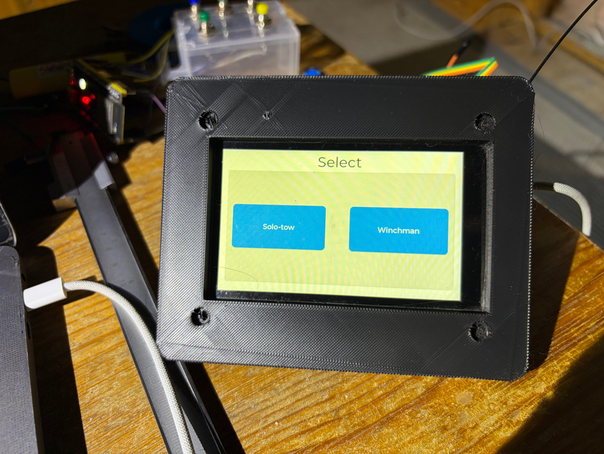

# GIGA Display Shield — panel-mount frame

A 3D-printed frame that mounts the Arduino GIGA Display Shield into the
front panel of the winchman's industrial electro box. It replaces the
shield's original snap-together case: here the industrial box *is* the
enclosure, so this part only has to provide the bezel, the panel
transition and the shield's four mounting standoffs.



## Design

- **Front flange** — the visible lip. Sits on the *outside* of the panel
  and hides the jigsaw-cut edge. Glued in, no flange screws.
- **Collar** — steps back from the flange and plugs through the cut hole.
  Its outer envelope is the size the jigsaw hole must be cut to
  (**112 × 86 mm**, with a small corner relief radius so the cut can turn
  each corner).
- **Four standoff bosses** inside the collar, on the shield's own
  `96 × 70 mm` M3 bolt pattern. The shield screws to these from behind;
  each boss tip sits `LCD_TO_PCB_HEIGHT` (6.45 mm) below the front face so
  the LCD glass ends up flush with the bezel.
- **LCD window** — the full glass module (98 × 58 mm) shows through.
- **RGB LED (DL1) light-pipe hole** — a straight 1.9 mm through-hole, to be
  filled with a short length of clear acrylic rod.
- **Screw-head counterbores** on the front face (6.2 × 2.8 mm) for M3
  bolts with a 5.5 mm head, seated just below flush.

Outer envelope: **128 × 102 × 7.5 mm**.

The reference geometry (bolt pattern, LCD window, glass-to-PCB depth) was
first derived from a boundary analysis of
`../freecad/drawings/Giga display shield case top.stl`. The first test
print was dimensionally sound but the window size and position were off;
every dimension was re-measured from the real board on 2026-09-01 and the
second print fits (photo above).

## Building it

Everything is driven from [`config.py`](config.py). Regenerate the model
and export the STL with:

```
/Applications/FreeCAD.app/Contents/Resources/bin/freecadcmd build.py
```

(or run `build.py` from FreeCAD's Python console). It writes
`GigaDisplayHolder.FCStd` and `giga_display_frame.stl`, and prints the
bounding box / solid-validity check.

The entry script is `build.py`, **not** `main.py` — FreeCAD's macro-path
lookup intercepts the basename `main.py` and would run the winch model's
`freecad/main.py` instead.

## Still open

- **`PANEL_THICKNESS`** is a 3.0 mm placeholder. Set it to the real front-
  panel thickness of the box once that's picked, then reprint. `COLLAR_HEIGHT`
  follows it automatically.
- The LED light-pipe hole position assumes the "3 mm from top / 26.5 mm
  from left" measurement was to the hole *centre*. Confirm it lines up
  once the shield is bolted in.

## Slicing

Printed on a FlashForge, ~6 h. Support goes under the standoff-boss
overhangs (they project from the flange's back face into the collar
cavity); that placement has printed cleanly twice. The front face has the
usual FDM top-surface texture and wants a light sand.
