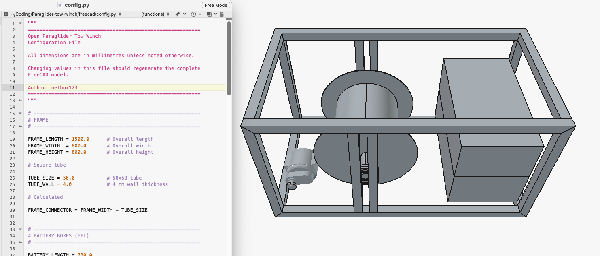

# Paraglider Tow Winch

An open-source electric tow winch for paragliding, designed with safety, reliability and maintainability as the primary goals.

The project combines:

- Parametric mechanical design in FreeCAD
- Python-generated CAD models
- Direct rope tension measurement using a load cell
- PID-controlled electric drive
- Automatic level winding using a self-reversing traverse screw
- Open documentation and engineering calculations

## Project Goals

The aim is to build a tow winch that:

- Maintains constant tow force independent of drum diameter.
- Winds the rope neatly during both retrieval and payout.
- Minimizes side loads on the level wind mechanism.
- Is easy to maintain using commercially available components.
- Can be reproduced and improved by other clubs.

## Current Concept

### Frame

- 1500 × 800 × 800 mm
- 50 × 50 × 4 mm square steel tube

### Drum

- Width: 400 mm
- Core diameter: 390 mm
- Flange diameter: 590 mm
- 5 mm steel shell
- 5 mm steel flanges
- 50 mm shaft
- Internal stiffening discs

### Power

Planned motor:

- QS165 12 kW
- 2.37:1 gearbox

### Rope

- 3 mm Dyneema
- Approximately 1500 m
- Typical tow tension: 40–100 kg

### Level Wind

A mechanically synchronized self-reversing traverse screw ("diamond screw" or "level wind screw") is used instead of a stepper motor.

Advantages:

- Works automatically in both winding directions.
- Always remains synchronized with the drum.
- No electronic positioning required.

### Tension Control

Tow force will be measured directly with a load cell mounted beneath the moving guide pulley.

Benefits:

- Direct measurement of rope tension.
- Independent of drum diameter.
- Independent of gearbox efficiency.
- Independent of motor current.
- Improved PID control.

## Software

The FreeCAD model is generated from Python macros.

The intention is that the complete winch can be regenerated from a small set of configuration parameters.

Future modules include:

- Frame
- Drum
- Motor
- Battery boxes
- Level wind
- Electronics
- Rope calculations
- Chain ratio calculations

## Status

This project is currently in the conceptual design phase.

The first objective is to create a fully parametric FreeCAD model before detailed fabrication begins.

## Contributions

Suggestions, calculations and constructive criticism are welcome.

The goal is to produce a safe, well-documented tow winch that can be used and improved by the paragliding community.

---

*Work in progress.*