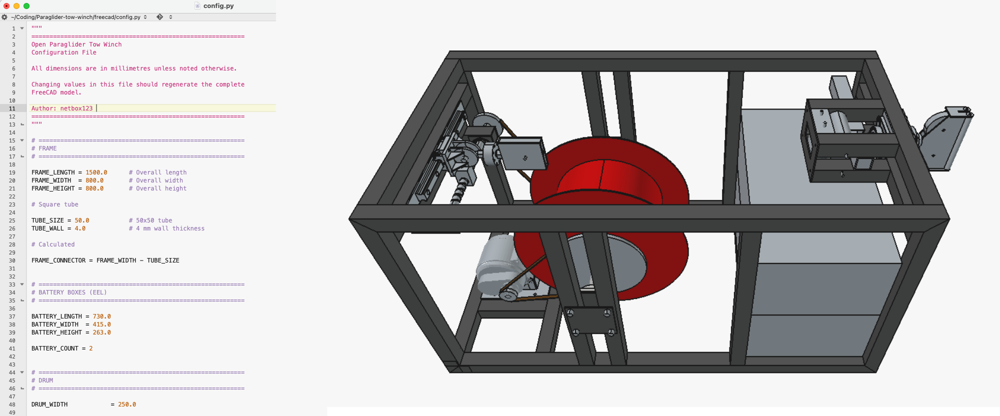

# Paraglider Tow Winch

Version 0.1

An open-source electric tow winch for paragliding, designed with safety, reliability and maintainability as the primary goals.

The project combines:

- Parametric mechanical design in FreeCAD
- Python-generated CAD models
- Direct rope tension measurement using a load cell
- PID-controlled electric drive
- Automatic level winding using a self-reversing traverse screw
- Open documentation and engineering calculations

## Project Goals

The aim is to build a tow winch that:

- Maintains constant tow force independent of drum diameter.
- Winds the rope neatly during both retrieval and payout.
- Minimizes side loads on the level wind mechanism.
- Is easy to maintain using commercially available components.
- Can be reproduced and improved by other clubs.

## Current Concept

### Frame

- 1500 × 800 × 800 mm
- 50 × 50 × 4 mm square steel tube

### Drum

- Width: 250 mm
- Core diameter: 390 mm
- Flange diameter: 590 mm
- 5 mm steel shell
- 5 mm steel flanges
- 50 mm shaft
- Internal stiffening discs

### Power

Planned motor:

- QS165 12 kW
- 2.37:1 gearbox

### Rope

- 3 mm Dyneema
- Approximately 1500 m
- Typical tow tension: 40–100 kg

### Level Wind

A mechanically synchronized self-reversing traverse screw ("diamond screw" or "level wind screw") is used instead of a stepper motor.

Advantages:

- Works automatically in both winding directions.
- Always remains synchronized with the drum.
- No electronic positioning required.

### Tension Control

Tow force will be measured directly with a load cell mounted beneath the moving guide pulley.

Benefits:

- Direct measurement of rope tension.
- Independent of drum diameter.
- Independent of gearbox efficiency.
- Independent of motor current.
- Improved PID control.

## Software

The FreeCAD model is generated from Python macros (`freecad/`), one module per subsystem, all driven from a single `config.py`.

The intention is that the complete winch can be regenerated from a small set of configuration parameters.

Modules built so far:

- Frame (hollow mitred tube)
- Battery boxes
- Drum (barrel, flanges, shaft, bearings)
- Motor mount and chain drivetrain (motor, sprockets)
- Rope intake (self-aligning swivel, rollers, guide wheels, line cutter)
- Level wind (Hiwin linear rail, self-reversing screw, flange bearings)
- Winding pulley and load cell mount (rod-end pivot)

Still open:

- Electronics (see [docs/electronics.md](docs/electronics.md))
- Frame cross-member mitres
- Motor mount bracket (currently a placeholder)

### Running the model

1. Install [FreeCAD](https://www.freecad.org/) (1.1 or newer).
2. Open FreeCAD and use **Macro → Macros… → Execute** to run `freecad/main.py`, or open it in the built-in Python console and run it directly.
3. `main.py` creates a new `TowWinch` document and builds the complete model from `config.py`. Edit values in `config.py` and re-run the macro to regenerate the model.

The model can also be regenerated headless (no GUI) with `freecadcmd freecad/main.py`, useful for scripted checks.

## Status

The FreeCAD model is parametric and covers the mechanical structure end-to-end: frame, drum, drivetrain, rope intake and level wind. Electronics design is underway (see [docs/electronics.md](docs/electronics.md)) but not yet built.

Fabrication of the frame has already started in parallel with the CAD work (see [docs/build_log.md](docs/build_log.md)).

See [docs/todo.md](docs/todo.md) for the detailed, up-to-date task list.

## Documentation

- [Mission statement](docs/mission_statement.md)
- [History and design philosophy](docs/history.md)
- [Control philosophy](docs/control_philosophy.md)
- [Electronics architecture](docs/electronics.md)
- [Design decisions](docs/design_decisions.md)
- [Rope / drive train calculations](docs/rope_calculations.md)
- [Build log](docs/build_log.md)
- [Todo list](docs/todo.md)

## Contributions

Suggestions, calculations and constructive criticism are welcome.

The goal is to produce a safe, well-documented tow winch that can be used and improved by the paragliding community.

---

*Work in progress.*